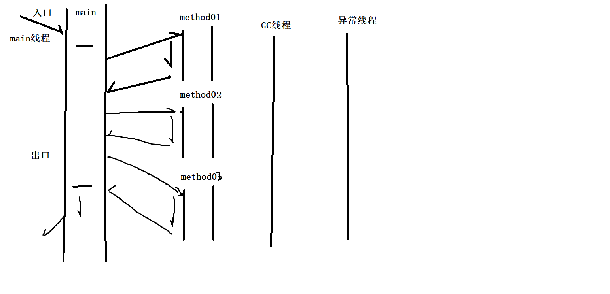
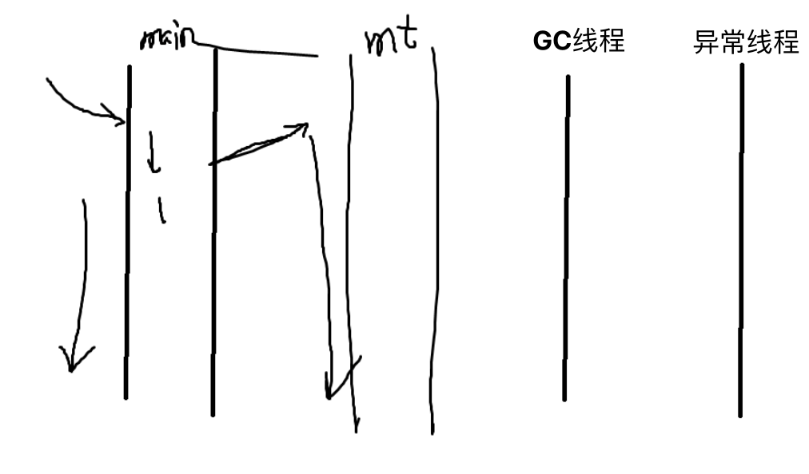

# ch01.多线程

>Java语言
>
>1. 基本语法
>2. 面向对象
>3. 类库 Thread

## 一、概念

### 1、程序

程序是为完成特定任务、用某种编程语言编写的一组指令的集合；

我们可以理解为程序是一段**静态的**代码，如安装在硬盘上程序，如QQ、迅雷等

### 2、进程

**正在运行的**程序就是一个进程，如运行中的QQ、迅雷等。

### 3、线程

进程可以进一步进行细化为线程，它是程序中的一条执行线路（路径）；

每个Java程序都至少有三个线程

1. **main主线程**
2. **gc()垃圾回收机制的运行线程**
3. **异常处理线程**

注意：

其中，垃圾回收机制的运行线程和异常处理线程是后台线程（保护线程）

在一个进程中，所有的前台线程都执行完毕，则整个程序就执行完毕，后台线程随之也结束

#### 1）单线程

当一个Java程序启动时，JVM会创建主线程，并且在该线程中调用程序的main()方法。

单线程是指应用程序只有一个执行线程。在单线程中，所有的任务都是按照顺序依次执行的，每个任务必须等待前一个任务完成后才能开始执行。单线程通常用于简单的应用程序，因为它们不需要处理大量的并发任务。

#### 2）多线程

多线程是指应用程序具有多个执行线程。在多线程中，不同的任务可以同时执行，从而提高应用程序的并发性和响应能力。多线程通常用于需要处理大量并发任务的应用程序，例如Web服务器（Tomcat）或数据库服务器。

#### 3）并发与并行

- 并发（concurrent）是同一时间应对（dealing with）多件事情的能力；
  - 在同一时刻，有多个指令在单个 CPU 上交替执行
- 并行（parallel）是同一时间动手做（doing）多件事情的能力；
  - 在同一时刻，有多个指令在多个 CPU 上同时执行

#### 4）同步与异步

- 需要等待结果返回，才能继续运行就是同步
- 不需要等待结果返回，就能继续运行就是异步

**线程的优点**

- 支持并发编程，同时地处理多个并发任务，充分利用CPU资源，从而提高程序的性能
- 实现异步处理，避免线程等待，提高应用程序的流畅性

## 二、实现

### 1、继承Thread

- 第一：定义一个类，继承Thread
- 第二：重写Thread类中的run方法，并在run方法实现具体的线程功能
- 第三：根据需要，创建线程对象
- 第四：启动线程 - start - run

### 2、实现Runnable接口

第一：定义一个类，实现Runnable接口

第二：重写Runnable接口中的run方法

第三：实例化Runnable接口对象

第四：通过Runnable接口对象实例化Thread对象

第五：启动线程

**两种实现对比，实现Runnable接口有以下好处**

- 便于共享相同代码，数据有效的分离，较好地体现了面向对象的设计思想
- 可以避免由于Java的单继承特性带来的局限
- `Thread`类实际上是`Runnable`接口的实现类，提供了线程相关操作的API方法

课堂练习

>1、创建线程对象，在线程对象中有50张电影票，分别创建三个线程对象（售票窗口），各自销售50张电影票，输出结果为：
>
>窗口一售出第50张电影票
>
>窗口一售出第49张电影票
>
>...
>
>2、创建线程对象，在线程对象中有50张电影票，分别创建三个线程对象（售票窗口），共同销售这50张电影票，输出结果为：
>
>窗口一售出第50张电影票
>
>窗口一售出第49张电影票
>
>窗口二售出第48张电影票
>
>窗口三售出第47张电影票
>
>...

### 3、实现Callable接口

### 4、线程池

## 三、API

## 四、线程同步

## 五、线程通讯